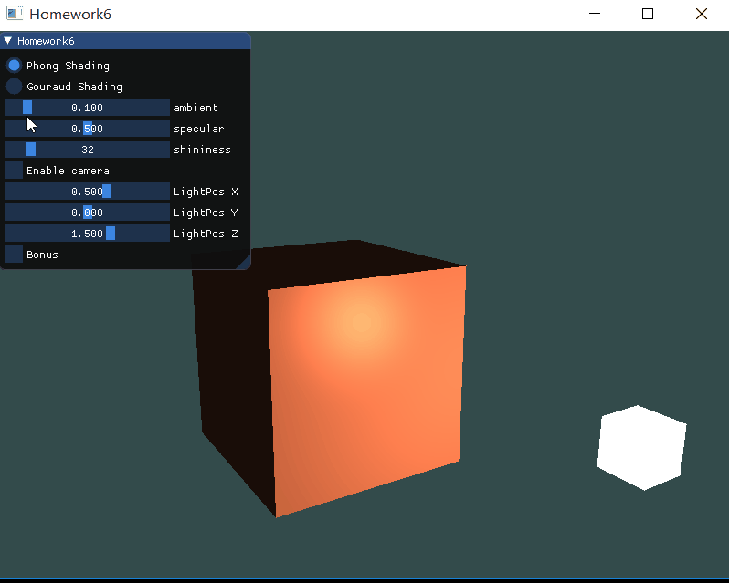
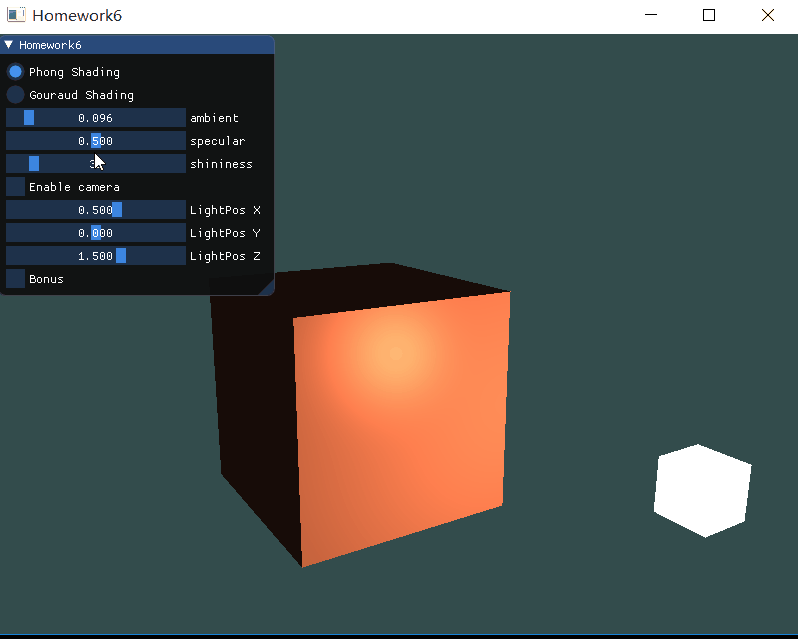
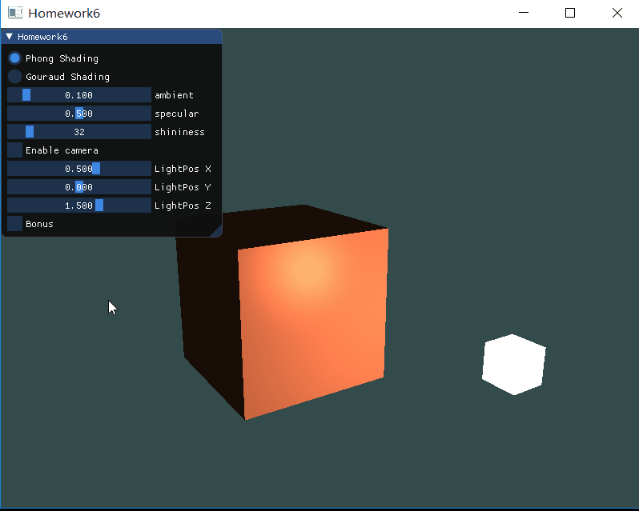

# 计算机图形学
## Homework6
### Basic
1. 实现Phong光照模型：
    - 场景中绘制一个cube
    - 自己写shader实现两种shading: Phong Shading 和 Gouraud Shading，并解释两种shading的实现原理
    - 合理设置视点、光照位置、光照颜色等参数，使光照效果明显显示
2. 使用GUI，使参数可调节，效果实时更改：
    - GUI里可以切换两种shading
    - 使用如进度条这样的控件，使ambient因子、diffuse因子、specular因子、反光度等参数可调节，光照效果实时更改

### 冯氏光照模型
冯氏光照模型的主要结构由3个分量组成：环境(Ambient)、漫反射(Diffuse)和镜面(Specular)光照。下面这张图展示了这些光照分量看起来的样子：  
  
- 环境光照(Ambient Lighting)：即使在黑暗的情况下，世界上通常也仍然有一些光亮（月亮、远处的光），所以物体几乎永远不会是完全黑暗的。为了模拟这个，我们会使用一个环境光照常量，它永远会给物体一些颜色。
- 漫反射光照(Diffuse Lighting)：模拟光源对物体的方向性影响(Directional Impact)。它是冯氏光照模型中视觉上最显著的分量。物体的某一部分越是正对着光源，它就会越亮。
- 镜面光照(Specular Lighting)：模拟有光泽物体上面出现的亮点。镜面光照的颜色相比于物体的颜色会更倾向于光的颜色

#### 环境光照
光通常都不是来自于同一个光源，而是来自于我们周围分散的很多光源，即使它们可能并不是那么显而易见。因此我们使用一个很小的常量（光照）颜色，添加到物体片段的最终颜色中，这样子的话即便场景中没有直接的光源也能看起来存在有一些发散的光。我们用光的颜色乘以一个很小的常量环境因子，再乘以物体的颜色，然后将最终结果作为片段的颜色：  
```
// 物体片段着色器
void main()
{
    float ambientStrength = 0.1;
    vec3 ambient = ambientStrength * lightColor;

    vec3 result = ambient * objectColor;
    FragColor = vec4(result, 1.0);
}
```
环境因子影响：  
  

#### 漫反射光照
漫反射光照使物体上与光线方向越接近的片段能从光源处获得更多的亮度。下图左上方有一个光源，它所发出的光线落在物体的一个片段上。我们需要测量这个光线是以什么角度接触到这个片段的。如果光线垂直于物体表面，这束光对物体的影响会最大化。为了测量光线和片段的角度，我们使用一个叫做法向量(Normal Vector)的东西，它是垂直于片段表面的一个向量（这里以黄色箭头表示）：  
  
法向量是一个垂直于顶点表面的（单位）向量。由于顶点本身并没有表面（它只是空间中一个独立的点），我们利用它周围的顶点来计算出这个顶点的表面。因此我们向顶点数组添加了额外的数据。  
然后就可以开始计算漫反射光照了：  
首先计算光源和片段位置之间的方向向量，光的方向向量是光源位置向量与片段位置向量之间的向量差，然后进行标准化；接着对norm和lightDir向量进行点乘，计算光源对当前片段实际的漫发射影响。结果值再乘以光的颜色，得到漫反射分量。再把得到的漫反射分量和之前的环境光分量相加，把结果乘以物体的颜色，来获得片段最后的输出颜色。  
这时候的物体的片段着色器：  
```
void main()
{
    vec3 ambient = ambientStrength * lightColor;

	vec3 norm = normalize(Normal);
	vec3 lightDir = normalize(lightPos - FragPos);
	float diff = max(dot(norm, lightDir), 0.0);
	vec3 diffuse = diff * lightColor;

    vec3 result = (ambient + diffuse) * objectColor;
    FragColor = vec4(result, 1.0);
}
```
最后为了模型矩阵在执行了不等比例的缩放后，法向量仍垂直表面，我们需要在物体的顶点着色器中加一个法线矩阵：  
```
void main()
{
	gl_Position = projection * view * model * vec4(aPos, 1.0);
	FragPos = vec3(model * vec4(aPos, 1.0));
	Normal = mat3(transpose(inverse(model))) * aNormal;
}
```

#### 镜面光照
和漫反射光照一样，镜面光照也是依据光的方向向量和物体的法向量来决定的，但是它也依赖于观察方向，例如玩家是从什么方向看着这个片段的。镜面光照是基于光的反射特性。如果我们想象物体表面像一面镜子一样，那么，无论我们从哪里去看那个表面所反射的光，镜面光照都会达到最大化。  
我们通过反射法向量周围光的方向来计算反射向量。然后我们计算反射向量和视线方向的角度差，如果夹角越小，那么镜面光的影响就会越大。它的作用效果就是，当我们去看光被物体所反射的那个方向的时候，我们会看到一个高光。  
观察向量是镜面光照附加的一个变量，我们可以使用观察者世界空间位置和片段的位置来计算它。之后，我们计算镜面光强度，用它乘以光源的颜色，再将它加上环境光和漫反射分量。因此得到最后的物体的片段着色器：  
```
#version 330 core
out vec4 FragColor;

in vec3 Normal;
in vec3 FragPos;
  
uniform vec3 objectColor;
uniform vec3 lightColor;
uniform vec3 lightPos;
uniform vec3 viewPos;
uniform float ambientStrength;
uniform float specularStrength;
uniform int shininess;

void main()
{
    vec3 ambient = ambientStrength * lightColor;

	vec3 norm = normalize(Normal);
	vec3 lightDir = normalize(lightPos - FragPos);
	float diff = max(dot(norm, lightDir), 0.0);
	vec3 diffuse = diff * lightColor;

	vec3 viewDir = normalize(viewPos - FragPos);
	vec3 reflectDir = reflect(-lightDir, norm);
	float spec = pow(max(dot(viewDir, reflectDir), 0.0), shininess);
	vec3 specular = specularStrength * spec * lightColor;

    vec3 result = (ambient + diffuse + specular) * objectColor;
    FragColor = vec4(result, 1.0);
}
```
specular因子影响：  
  
反光度影响：  
  

### Phong Shading & Gouraud Shading
Phong shading和Gouraud shading其实都是应用冯氏光照模型，只不过区别在于phong shading是在片段着色器中实现冯氏光照模型，而gouraud shading是在顶点着色器中实现。在顶点着色器中做光照的优势是，相比片段来说，顶点要少得多，因此会更高效，所以（开销大的）光照计算频率会更低。然而，顶点着色器中的最终颜色值是仅仅只是那个顶点的颜色值，片段的颜色值是由插值光照颜色所得来的。结果就是这种光照看起来不会非常真实，除非使用了大量顶点。  

#### Gouraud Shading的着色器实现
```
// 物体的顶点着色器gouraudShader.vs
#version 330 core
layout(location = 0) in vec3 aPos;
layout(location = 1) in vec3 aNormal;

out vec3 ourColor;

uniform mat4 model;
uniform mat4 view;
uniform mat4 projection;

uniform vec3 objectColor;
uniform vec3 lightColor;
uniform vec3 lightPos;
uniform vec3 viewPos;
uniform float ambientStrength;
uniform float specularStrength;
uniform int shininess;

void main()
{
	gl_Position = projection * view * model * vec4(aPos, 1.0);
	vec3 FragPos = vec3(model * vec4(aPos, 1.0));
	vec3 Normal = mat3(transpose(inverse(model))) * aNormal;

	vec3 ambient = ambientStrength * lightColor;
    
	vec3 norm = normalize(Normal);
	vec3 lightDir = normalize(lightPos - FragPos);
	float diff = max(dot(norm, lightDir), 0.0);
	vec3 diffuse = diff * lightColor;

	vec3 viewDir = normalize(viewPos - FragPos);
    vec3 reflectDir = reflect(-lightDir, norm);  
    float spec = pow(max(dot(viewDir, reflectDir), 0.0), shininess);
    vec3 specular = specularStrength * spec * lightColor;  

    ourColor = (ambient + diffuse + specular) * objectColor;
}
```
```
// 物体的片段着色器gouraudShading.fs
#version 330 core
out vec4 FragColor;
in vec3 ourColor;

void main()
{
    FragColor = vec4(ourColor, 1.0);
}
```
phong shading和gouraud shading的对比：  
  

### Bonus
光源的移动比较简单，只要改一下光源的cube的位置即可。  
这里实现了一个围绕物体旋转的场景：  
```
    if (lightMove) {
        float radius = 1.5f;
        float X = sin(glfwGetTime()) * radius;
        float Z = cos(glfwGetTime()) * radius;
        lightPos = glm::vec3(X, 0.0f, Z);
    }
```
效果：  
  

### 代码实现
首先设置好物体和光源：  
**顶点数据**  
```
// 前三个float为坐标，后三个为法向量
float vertices[] = {
		-0.5f, -0.5f, -0.5f,  0.0f,  0.0f, -1.0f,
		 0.5f, -0.5f, -0.5f,  0.0f,  0.0f, -1.0f,
		 0.5f,  0.5f, -0.5f,  0.0f,  0.0f, -1.0f,
		 0.5f,  0.5f, -0.5f,  0.0f,  0.0f, -1.0f,
		-0.5f,  0.5f, -0.5f,  0.0f,  0.0f, -1.0f,
		-0.5f, -0.5f, -0.5f,  0.0f,  0.0f, -1.0f,

		-0.5f, -0.5f,  0.5f,  0.0f,  0.0f,  1.0f,
		 0.5f, -0.5f,  0.5f,  0.0f,  0.0f,  1.0f,
		 0.5f,  0.5f,  0.5f,  0.0f,  0.0f,  1.0f,
		 0.5f,  0.5f,  0.5f,  0.0f,  0.0f,  1.0f,
		-0.5f,  0.5f,  0.5f,  0.0f,  0.0f,  1.0f,
		-0.5f, -0.5f,  0.5f,  0.0f,  0.0f,  1.0f,

		-0.5f,  0.5f,  0.5f, -1.0f,  0.0f,  0.0f,
		-0.5f,  0.5f, -0.5f, -1.0f,  0.0f,  0.0f,
		-0.5f, -0.5f, -0.5f, -1.0f,  0.0f,  0.0f,
		-0.5f, -0.5f, -0.5f, -1.0f,  0.0f,  0.0f,
		-0.5f, -0.5f,  0.5f, -1.0f,  0.0f,  0.0f,
		-0.5f,  0.5f,  0.5f, -1.0f,  0.0f,  0.0f,

		 0.5f,  0.5f,  0.5f,  1.0f,  0.0f,  0.0f,
		 0.5f,  0.5f, -0.5f,  1.0f,  0.0f,  0.0f,
		 0.5f, -0.5f, -0.5f,  1.0f,  0.0f,  0.0f,
		 0.5f, -0.5f, -0.5f,  1.0f,  0.0f,  0.0f,
		 0.5f, -0.5f,  0.5f,  1.0f,  0.0f,  0.0f,
		 0.5f,  0.5f,  0.5f,  1.0f,  0.0f,  0.0f,

		-0.5f, -0.5f, -0.5f,  0.0f, -1.0f,  0.0f,
		 0.5f, -0.5f, -0.5f,  0.0f, -1.0f,  0.0f,
		 0.5f, -0.5f,  0.5f,  0.0f, -1.0f,  0.0f,
		 0.5f, -0.5f,  0.5f,  0.0f, -1.0f,  0.0f,
		-0.5f, -0.5f,  0.5f,  0.0f, -1.0f,  0.0f,
		-0.5f, -0.5f, -0.5f,  0.0f, -1.0f,  0.0f,

		-0.5f,  0.5f, -0.5f,  0.0f,  1.0f,  0.0f,
		 0.5f,  0.5f, -0.5f,  0.0f,  1.0f,  0.0f,
		 0.5f,  0.5f,  0.5f,  0.0f,  1.0f,  0.0f,
		 0.5f,  0.5f,  0.5f,  0.0f,  1.0f,  0.0f,
		-0.5f,  0.5f,  0.5f,  0.0f,  1.0f,  0.0f,
		-0.5f,  0.5f, -0.5f,  0.0f,  1.0f,  0.0f
	};
```
**绑定顶点数据**  
物体与光源都是cube，而且可以都用上面的顶点数据，只要调下大小和位置就可以了。而因为在后面计算漫反射光照的时候要用到顶点的法向量，所以在绑定物体的顶点数据时要多加一组法向量。  
```
    unsigned int VBO;
	glGenBuffers(1, &VBO);
	glBindBuffer(GL_ARRAY_BUFFER, VBO);
	glBufferData(GL_ARRAY_BUFFER, sizeof(vertices), vertices, GL_STATIC_DRAW);

	unsigned int cubeVAO;
	glBindBuffer(GL_ARRAY_BUFFER, VBO);

	glGenVertexArrays(1, &cubeVAO);
	glBindVertexArray(cubeVAO);
	
	glVertexAttribPointer(0, 3, GL_FLOAT, GL_FALSE, 6 * sizeof(float), (void*)0);
	glEnableVertexAttribArray(0);

	glVertexAttribPointer(1, 3, GL_FLOAT, GL_FALSE, 6 * sizeof(float), (void*)(3 * sizeof(float)));
	glEnableVertexAttribArray(1);

	unsigned int lightVAO;
	glBindBuffer(GL_ARRAY_BUFFER, VBO);
	glGenVertexArrays(1, &lightVAO);
	glBindVertexArray(lightVAO);

	glVertexAttribPointer(0, 3, GL_FLOAT, GL_FALSE, 6 * sizeof(float), (void*)0);
	glEnableVertexAttribArray(0);
```
**着色器**
物体和光源的顶点数据可以用一样的，但是着色器需要两个，光源的着色器：
```
// 光源顶点着色器lightShader.vs
#version 330 core
layout (location = 0) in vec3 aPos;

uniform mat4 model;
uniform mat4 view;
uniform mat4 projection;

void main()
{
	gl_Position = projection * view * model * vec4(aPos, 1.0);
}
```
```
// 光源片段着色器lightShader.fs
#version 330 core
out vec4 FragColor;

void main()
{
    FragColor = vec4(1.0);
}
```
物体的着色器：  
```
// 物体的顶点着色器
#version 330 core
layout(location = 0) in vec3 aPos;
layout(location = 1) in vec3 aNormal;

out vec3 Normal;
out vec3 FragPos;

uniform mat4 model;
uniform mat4 view;
uniform mat4 projection;

void main()
{
	gl_Position = projection * view * model * vec4(aPos, 1.0);
	FragPos = vec3(model * vec4(aPos, 1.0));
	Normal = mat3(transpose(inverse(model))) * aNormal;
}

```
```
// 物体的片段着色器
#version 330 core
out vec4 FragColor;

in vec3 Normal;
in vec3 FragPos;
  
uniform vec3 objectColor;
uniform vec3 lightColor;
uniform vec3 lightPos;
uniform vec3 viewPos;
uniform float ambientStrength;
uniform float specularStrength;
uniform int shininess;

void main()
{
    vec3 ambient = ambientStrength * lightColor;

	vec3 norm = normalize(Normal);
	vec3 lightDir = normalize(lightPos - FragPos);
	float diff = max(dot(norm, lightDir), 0.0);
	vec3 diffuse = diff * lightColor;

	vec3 viewDir = normalize(viewPos - FragPos);
	vec3 reflectDir = reflect(-lightDir, norm);
	float spec = pow(max(dot(viewDir, reflectDir), 0.0), shininess);
	vec3 specular = specularStrength * spec * lightColor;

    vec3 result = (ambient + diffuse + specular) * objectColor;
    FragColor = vec4(result, 1.0);
}
```
使用着色器：  
```
    shader.use();
	shader.setVec3("objectColor", 1.0f, 0.5f, 0.31f);
	shader.setVec3("lightColor", 1.0f, 1.0f, 1.0f);
	shader.setVec3("lightPos", lightPos);
	shader.setVec3("viewPos", camera.Position);

	glm::mat4 projection = glm::perspective(glm::radians(camera.Zoom), (float)SCR_WIDTH / (float)SCR_HEIGHT, 0.1f, 100.0f);
	glm::mat4 view = camera.GetViewMat();
	glm::mat4 model = glm::mat4(1.0f);

	shader.setMat4("projection", projection);
	shader.setMat4("view", view);
	shader.setMat4("model", model);

	shader.setFloat("ambientStrength", ambientStrength);
	shader.setFloat("specularStrength", specularStrength);
	shader.setInt("shininess", shininess);

	glBindVertexArray(cubeVAO);
	glDrawArrays(GL_TRIANGLES, 0, 36);

	lightShader.use();
	lightShader.setMat4("projection", projection);
	lightShader.setMat4("view", view);
	model = glm::mat4(1.0f);
	model = glm::translate(model, lightPos);
	model = glm::scale(model, glm::vec3(0.2f));
	lightShader.setMat4("model", model);

	glBindVertexArray(lightVAO);
	glDrawArrays(GL_TRIANGLES, 0, 36);
```

### Gui
```
ImGui::Begin("Homework6");
ImGui::RadioButton("Phong Shading", &shaderType, 0);
ImGui::RadioButton("Gouraud Shading", &shaderType, 1);

ImGui::SliderFloat("ambient", &ambientStrength, 0.0f, 1.0f);
ImGui::SliderFloat("specular", &specularStrength, 0.0f, 1.0f);ImGui::SliderInt("shininess", &shininess, 0, 256);

ImGui::Checkbox("Enable camera", &enableCamera);
ImGui::SliderFloat("LightPos X", &lightX, -2.0f, 2.0f);
ImGui::SliderFloat("LightPos Y", &lightY, -2.0f, 2.0f);
ImGui::SliderFloat("LightPos Z", &lightZ, -5.0f, 5.0f);

ImGui::Checkbox("Bonus", &lightMove);
		
ImGui::End();
```

### 整体运行效果
  