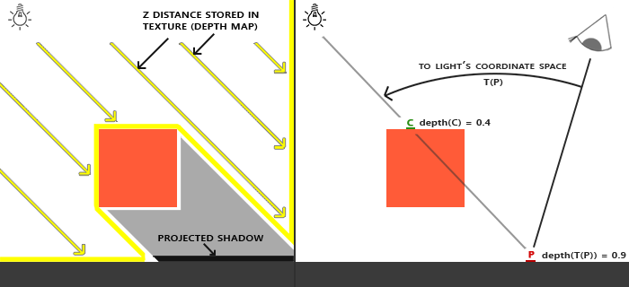
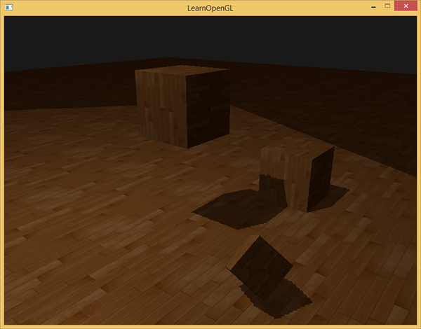

# 计算机图形学
## Homework7
### Basic
1. 实现方向光源的Shadowing Mapping:  
    - 要求场景中至少有一个object和一块平面(用于显示shadow)  
    - 光源的投影方式任选其一即可  
    - 在报告里结合代码，解释Shadowing Mapping算法  
2. 修改GUI  

### Shadow Mapping  
**阴影映射(Shadow Mapping)** 背后的思路非常简单：我们以光的位置为视角进行渲染，我们能看到的东西都将被点亮，看不见的一定是在阴影之中了。假设有一个地板，在光源和它之间有一个大盒子。由于光源处向光线方向看去，可以看到这个盒子，但看不到地板的一部分，这部分就应该在阴影中了。  
  
我们从光源的透视图来渲染场景，并把深度值的结果储存到纹理中，通过储存到深度贴图中的深度值，我们就能找到最近点，用以决定片元是否在阴影中。我们使用一个来自光源的视图和投影矩阵来渲染场景就能创建一个深度贴图。这个投影和视图矩阵结合在一起成为一个T变换，它可以将任何三维位置转变到光源的可见坐标空间。  
  

### 实现
1. 深度贴图  
第一步我们需要生成一张深度贴图(Depth Map)。深度贴图是从光的透视图里渲染的深度纹理，用它计算阴影。因为我们需要将场景的渲染结果储存到一个纹理中，我们将再次需要帧缓冲。  
```
void ShadowMapping::setDepthMap() {
	glGenFramebuffers(1, &depthMapFBO);
	// create depth texture
	glGenTextures(1, &depthMap);
	glBindTexture(GL_TEXTURE_2D, depthMap);
	glTexImage2D(GL_TEXTURE_2D, 0, GL_DEPTH_COMPONENT, SHADOW_WIDTH, SHADOW_HEIGHT, 0, GL_DEPTH_COMPONENT, GL_FLOAT, NULL);
	glTexParameteri(GL_TEXTURE_2D, GL_TEXTURE_MIN_FILTER, GL_NEAREST);
	glTexParameteri(GL_TEXTURE_2D, GL_TEXTURE_MAG_FILTER, GL_NEAREST);
	glTexParameteri(GL_TEXTURE_2D, GL_TEXTURE_WRAP_S, GL_CLAMP_TO_BORDER);
	glTexParameteri(GL_TEXTURE_2D, GL_TEXTURE_WRAP_T, GL_CLAMP_TO_BORDER);
	float borderColor[] = { 1.0, 1.0, 1.0, 1.0 };
	glTexParameterfv(GL_TEXTURE_2D, GL_TEXTURE_BORDER_COLOR, borderColor);
	// attach depth texture as FBO's depth buffer
	glBindFramebuffer(GL_FRAMEBUFFER, depthMapFBO);
	glFramebufferTexture2D(GL_FRAMEBUFFER, GL_DEPTH_ATTACHMENT, GL_TEXTURE_2D, depthMap, 0);
	glDrawBuffer(GL_NONE);
	glReadBuffer(GL_NONE);
	glBindFramebuffer(GL_FRAMEBUFFER, 0);
}
```

2. 渲染阶段  
渲染阶段分为两部分：1. 首选渲染深度贴图；2. 像往常一样渲染场景，但这次使用深度贴图。  
    ```
    // 1. 首选渲染深度贴图
    glViewport(0, 0, SHADOW_WIDTH, SHADOW_HEIGHT);
    glBindFramebuffer(GL_FRAMEBUFFER, depthMapFBO);
        glClear(GL_DEPTH_BUFFER_BIT);
        ConfigureShaderAndMatrices();
        RenderScene();
    glBindFramebuffer(GL_FRAMEBUFFER, 0);
    // 2. 像往常一样渲染场景，但这次使用深度贴图
    glViewport(0, 0, SCR_WIDTH, SCR_HEIGHT);
    glClear(GL_COLOR_BUFFER_BIT | GL_DEPTH_BUFFER_BIT);
    ConfigureShaderAndMatrices();
    glBindTexture(GL_TEXTURE_2D, depthMap);
    RenderScene();
    ```
    这段代码隐去了一些细节，但它表达了阴影映射的基本思路。这里一定要记得调用glViewport。因为阴影贴图经常和我们原来渲染的场景（通常是窗口解析度）有着不同的解析度，我们需要改变视口（viewport）的参数以适应阴影贴图的尺寸。如果我们忘了更新视口参数，最后的深度贴图要么太小要么就不完整。  

3. 渲染深度贴图
```
    if (mappingType) {
		lightProjection = glm::ortho(-10.0f, 10.0f, -10.0f, 10.0f, near_plane, far_plane);
	}
	else {
		lightProjection = glm::perspective(glm::radians(45.0f), (float)width / (float)height, near_plane, far_plane);
	}

	
	lightView = glm::lookAt(lightPos, glm::vec3(0.0f), glm::vec3(0.0f, 1.0f, 0.0f));
	lightSpaceMatrix = lightProjection * lightView;

	depthShader.use();
	depthShader.setMat4("lightSpaceMatrix", lightSpaceMatrix);

	glViewport(0, 0, SHADOW_WIDTH, SHADOW_HEIGHT);
	glBindFramebuffer(GL_FRAMEBUFFER, depthMapFBO);
	glClear(GL_DEPTH_BUFFER_BIT);
	glActiveTexture(GL_TEXTURE0);
	glBindTexture(GL_TEXTURE_2D, woodTexture);
	renderScene(depthShader);
	glBindFramebuffer(GL_FRAMEBUFFER, 0);
```
当我们以光的透视图进行场景渲染的时候，我们会用一个比较简单的着色器，这个着色器除了把顶点变换到光空间以外，不会做得更多了。这个简单的着色器叫做depthShader，就是使用下面的这个着色器：  
```
// 顶点着色器
#version 330 core
layout (location = 0) in vec3 position;

uniform mat4 lightSpaceMatrix;
uniform mat4 model;

void main()
{
    gl_Position = lightSpaceMatrix * model * vec4(position, 1.0f);
}

// 片段着色器
#version 330 core

void main()
{             
    // gl_FragDepth = gl_FragCoord.z;
}
```

4. 渲染阴影  
得到深度图之后，接下来就是以Camera的角度渲染场景，这跟往常一样渲染场景，但是使用的是深度贴图。  
首先我们在顶点着色器中进行光空间的变换：  
```
#version 330 core
layout (location = 0) in vec3 aPos;
layout (location = 1) in vec3 aNormal;
layout (location = 2) in vec2 aTexCoords;

out vec2 TexCoords;

out VS_OUT {
    vec3 FragPos;
    vec3 Normal;
    vec2 TexCoords;
    vec4 FragPosLightSpace;
} vs_out;

uniform mat4 projection;
uniform mat4 view;
uniform mat4 model;
uniform mat4 lightSpaceMatrix;

void main()
{
    vs_out.FragPos = vec3(model * vec4(aPos, 1.0));
    vs_out.Normal = transpose(inverse(mat3(model))) * aNormal;
    vs_out.TexCoords = aTexCoords;
    vs_out.FragPosLightSpace = lightSpaceMatrix * vec4(vs_out.FragPos, 1.0);
    gl_Position = projection * view * model * vec4(aPos, 1.0);
}
```
接着在片段着色器中使用Blinn-Phong光照模型渲染场景：  
```
#version 330 core
out vec4 FragColor;

in VS_OUT {
    vec3 FragPos;
    vec3 Normal;
    vec2 TexCoords;
    vec4 FragPosLightSpace;
} fs_in;

uniform sampler2D diffuseTexture;
uniform sampler2D shadowMap;

uniform vec3 lightPos;
uniform vec3 viewPos;
uniform float ambientStrength;
uniform float specularStrength;
uniform int shininess;

float ShadowCalculation(vec4 fragPosLightSpace) {
    vec3 projCoords = fragPosLightSpace.xyz / fragPosLightSpace.w;
    [......]
        
    return shadow;
}

void main()
{           
    vec3 color = texture(diffuseTexture, fs_in.TexCoords).rgb;
    vec3 normal = normalize(fs_in.Normal);
    vec3 lightColor = vec3(0.3);

    vec3 ambient = ambientStrength * color;

    vec3 lightDir = normalize(lightPos - fs_in.FragPos);
    float diff = max(dot(lightDir, normal), 0.0);
    vec3 diffuse = diff * lightColor;

    vec3 viewDir = normalize(viewPos - fs_in.FragPos);
    vec3 reflectDir = reflect(-lightDir, normal);
    float spec = 0.0;
    vec3 halfwayDir = normalize(lightDir + viewDir);  
    spec = pow(max(dot(normal, halfwayDir), 0.0), shininess);
    vec3 specular = specularStrength * spec * lightColor;    

    float shadow = ShadowCalculation(fs_in.FragPosLightSpace);                      
    vec3 lighting = (ambient + (1.0 - shadow) * (diffuse + specular)) * color;    
    
    FragColor = vec4(lighting, 1.0);
}
```  

5. 正交和透视投影  
上面的阴影是使用正交投影实现的，接下来使用透视投影实现。  
使用透视投影实现其实只需要在创建阴影纹理时将正交投影矩阵换成透视投影矩阵即可：  
```
shadow_mapping_shadows.png
lightProjection = glm::perspective(glm::radians(45.0f), (float)width / (float)height, near_plane, far_plane);
```
需要注意的是，透视投影矩阵，将深度缓冲视觉化经常会得到一个几乎全白的结果。发生这个是因为透视投影下，深度变成了非线性的深度值，它的大多数可辨范围接近于近平面。为了可以像使用正交投影一样合适的观察到深度值，必须先将非线性深度值转变为线性的。  
```
float LinearizeDepth(float depth)
{
    float z = depth * 2.0 - 1.0; // Back to NDC 
    return (2.0 * near_plane * far_plane) / (far_plane + near_plane - z * (far_plane - near_plane));
}
```

### 优化
#### 阴影失真
在前面渲染完场景后，运行程序，我们会发现有明显的线条样式：  
  
这种阴影贴图的不真实感叫做阴影失真(Shadow Acne)，下图解释了成因：  
  
当光源以一个角度朝向表面的时候，深度贴图也是从一个角度下进行渲染的。多个片元就会从同一个斜坡的深度纹理像素中采样，有些在地板上面，有些在地板下面；这样我们所得到的阴影就有了差异。因为这个，有些片元被认为是在阴影之中，有些不在，由此产生了图片中的条纹样式。  
我们可以用一个叫做阴影偏移（shadow bias）的技巧来解决这个问题，我们简单的对表面的深度（或深度贴图）应用一个偏移量，这样片元就不会被错误地认为在表面之下了。  
  
我们可以这样实现这个偏移：  
```
float bias = max(0.05 * (1.0 - dot(normal, lightDir)), 0.0001);
float shadow = currentDepth - bias > closestDepth  ? 1.0 : 0.0;
```

#### 悬浮
使用阴影偏移的一个缺点是你对物体的实际深度应用了平移。偏移有可能足够大，以至于可以看出阴影相对实际物体位置的偏移，你可以从下图看到这个现象（这是一个夸张的偏移值）：  
  
这个阴影失真叫做悬浮(Peter Panning)。我们可以使用一个叫技巧解决大部分的Peter panning问题：当渲染深度贴图时候使用正面剔除（front face culling）。  
```
glCullFace(GL_FRONT);
RenderSceneToDepthMap();
glCullFace(GL_BACK); // 不要忘记设回原先的culling face
```

#### 采样过多
有一个视觉差异是光的视锥不可见的区域一律被认为是处于阴影中，不管它真的处于阴影之中。出现这个状况是因为超出光的视锥的投影坐标比1.0大，这样采样的深度纹理就会超出他默认的0到1的范围。根据纹理环绕方式，我们将会得到不正确的深度结果，它不是基于真实的来自光源的深度值。  
  
你可以在图中看到，光照有一个区域，超出该区域就成为了阴影；这个区域实际上代表着深度贴图的大小，这个贴图投影到了地板上。发生这种情况的原因是我们之前将深度贴图的环绕方式设置成了GL_REPEAT。  
我们宁可让所有超出深度贴图的坐标的深度范围是1.0，这样超出的坐标将永远不在阴影之中。我们可以储存一个边框颜色，然后把深度贴图的纹理环绕选项设置为GL_CLAMP_TO_BORDER：  
```
glTexParameteri(GL_TEXTURE_2D, GL_TEXTURE_WRAP_S, GL_CLAMP_TO_BORDER);
glTexParameteri(GL_TEXTURE_2D, GL_TEXTURE_WRAP_T, GL_CLAMP_TO_BORDER);
GLfloat borderColor[] = { 1.0, 1.0, 1.0, 1.0 };
glTexParameterfv(GL_TEXTURE_2D, GL_TEXTURE_BORDER_COLOR, borderColor);
```
仍有一部分是黑暗区域。那里的坐标超出了光的正交视锥的远平面。解决这个问题也很简单，只要投影向量的z坐标大于1.0，我们就把shadow的值强制设为0.0：  
```
float ShadowCalculation(vec4 fragPosLightSpace)
{
    [...]
    if(projCoords.z > 1.0)
        shadow = 0.0;

    return shadow;
}
```

#### 阴影边缘优化
消除锯齿化主要有两种方法：  
1. 通过增加深度贴图解析度的方式来降低锯齿块，也可以尝试尽可能的让光的视锥接近场景。
2. PCF（percentage-closer filtering），这是一种多个不同过滤方式的组合，它产生柔和阴影，使它们出现更少的锯齿块和硬边。核心思想是从深度贴图中多次采样，每一次采样的纹理坐标都稍有不同。每个独立的样本可能在也可能不再阴影中。所有的次生结果接着结合在一起，进行平均化，我们就得到了柔和阴影。  
一个简单的PCF的实现是简单的从纹理像素四周对深度贴图采样，然后把结果平均起来：  
```
float shadow = 0.0;
vec2 texelSize = 1.0 / textureSize(shadowMap, 0);
for(int x = -1; x <= 1; ++x)
{
    for(int y = -1; y <= 1; ++y)
    {
        float pcfDepth = texture(shadowMap, projCoords.xy + vec2(x, y) * texelSize).r; 
        shadow += currentDepth - bias > pcfDepth ? 1.0 : 0.0;        
    }    
}
shadow /= 18.0f;
```

### 运行结果
- 正交和透视投影对比  
    正交投影：  
      
    透视投影：  
      
- 抗锯齿化  
    效果：  
      
- 整体运行结果  
        