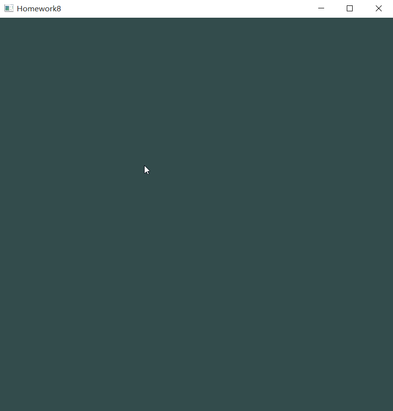

# 计算机图形学
## Homework8
### Basic
1. 用户能通过左键点击添加Bezier曲线的控制点，右键点击则对当前添加的最后一个控制点进行消除
2. 工具根据鼠标绘制的控制点实时更新Bezier曲线。

### Bonus
1. 可以动态地呈现Bezier曲线的生成过程。

### Bezier曲线
Bézier curve本质上是由调和函数（Harmonic functions）根据控制点（Control points）插值生成。其参数方程如下：  
$$ Q(t) = \sum_{i=0}^n P_i B_{i,n}(t), t\in[0, 1] $$  
上式为n次多项式，具有 n + 1项。其中，𝑃i(i = 0,1…n)表示特征多边形的n + 1个顶点向量； Bi,n(t)为伯恩斯坦（Bernstein）基函数，其多项式表示为：  
$$ B_{i,n}(t)=\frac {n!}{i!(n-i)!}t^i(1-t)^{n-i}, i =0, 1, 2····n $$  

### 代码实现
#### 鼠标点击事件
单击鼠标左键，获取鼠标坐标，先判断该点之前是否已经被记录，若否，则把该坐标加到向量point中；单击鼠标右键，若point不为空，则移除最后一个添加的点。  
```
void onClick(GLFWwindow* window, int button, int action, int mods) {
	if (button == GLFW_MOUSE_BUTTON_LEFT && action == GLFW_PRESS) {
		double x, y;
		glfwGetCursorPos(window, &x, &y);
		x = float(x - SCR_WIDTH / 2) / float(SCR_WIDTH / 2);
		y = float(SCR_HEIGHT / 2 - y) / float(SCR_HEIGHT / 2);

		for (int i = 0, len = bezierCurve.point.size(); i < len; i++) {
			if (bezierCurve.point[i].x == x && bezierCurve.point[i].y == y) {
				return;
			}
		}

		if (bezierCurve.point.size() < 99) {
			bezierCurve.point.push_back(glm::vec2(x, y));
			animation = 0;
		}
	}
	else if (button == GLFW_MOUSE_BUTTON_RIGHT && action == GLFW_PRESS) {
		if (bezierCurve.point.size() > 0) {
			bezierCurve.point.pop_back();
			animation = 0;
		}
	}
}
```

#### 绘制鼠标左键点击的点
将point中记录的点的坐标用数组来储存，方便后面绑定到VBO上，然后绘制  
```
void BezierCurve::renderPoint() {
	// 将点从向量转换成数组储存
	for (int i = 0, len = point.size(); i < len; i++) {
		vertices[2 * i] = point[i].x;
		vertices[2 * i + 1] = point[i].y;
	}

	// 绘制点和直线
	unsigned int VBO, VAO;
	glGenBuffers(1, &VBO);
	glBindBuffer(GL_ARRAY_BUFFER, VBO);
	glBufferData(GL_ARRAY_BUFFER, 2 * sizeof(float) * point.size(), vertices, GL_STATIC_DRAW);

	glBindBuffer(GL_ARRAY_BUFFER, VBO);
	glGenVertexArrays(1, &VAO);
	glBindVertexArray(VAO);

	glVertexAttribPointer(0, 2, GL_FLOAT, GL_FALSE, 2 * sizeof(float), (void*)0);
	glEnableVertexAttribArray(0);

	glPointSize(8.0f);
	glDrawArrays(GL_POINTS, 0, point.size());

	if (point.size() > 1) {
		glPointSize(1.0f);
		glDrawArrays(GL_LINE_STRIP, 0, point.size());
	}

	glDeleteVertexArrays(1, &VAO);
	glDeleteBuffers(1, &VBO);
}
```

#### 计算bezier曲线并绘制
因为公式中包含了Bernstein基函数，而该基函数中有阶乘的操作，所以先定义阶乘的函数：  
```
long int BezierCurve::factorial(int x) {
	if (x == 0) return 1;
	int result = 1;
	for (int i = 1; i <= x; i++) {
		result *= i;
	}
	return result;
}
```  
然后根据公式来计算：  
```
void BezierCurve::renderCurve() {
	// 计算bezier曲线上的点的坐标
	curvePointCount = 0;
	if (point.size() > 1) {
		for (float t = 0; t < 1; t += 0.001) {
			float cx = 0, cy = 0;
			for (int i = 0, n = point.size() - 1; i <= n; i++) {
				float bernstein = factorial(n) / (factorial(i) * factorial(n - i)) * pow(t, i) * pow(1 - t, n - i);
				cx += point[i].x * bernstein;
				cy += point[i].y * bernstein;
			}
			curveVertices[curvePointCount * 2] = cx;
			curveVertices[curvePointCount * 2 + 1] = cy;
			curvePointCount++;
		}
	}

	// 绘制bezier曲线
	unsigned int curveVBO, curveVAO;
	glGenBuffers(1, &curveVBO);
	glBindBuffer(GL_ARRAY_BUFFER, curveVBO);
	glBufferData(GL_ARRAY_BUFFER, 2 * sizeof(float) * curvePointCount, curveVertices, GL_STATIC_DRAW);

	glBindBuffer(GL_ARRAY_BUFFER, curveVBO);
	glGenVertexArrays(1, &curveVAO);
	glBindVertexArray(curveVAO);

	glVertexAttribPointer(0, 2, GL_FLOAT, GL_FALSE, 2 * sizeof(float), (void*)0);
	glEnableVertexAttribArray(0);

	glPointSize(1.0f);
	glDrawArrays(GL_POINTS, 0, curvePointCount);

	glDeleteVertexArrays(1, &curveVAO);
	glDeleteBuffers(1, &curveVBO);
}
```

#### 动态呈现曲线生成过程
动态呈现曲线生成过程其实就是递归插值的过程，给定n个点就需要递归n-1次，计算插值后的点的坐标之后绘制即可：  
```
void BezierCurve::dynamicDisplay(vector<glm::vec2> vertex, float animation) {
	int size = vertex.size();
	if (size <= 1) return;

	// 计算动态呈现过程中的点的坐标
	vector<glm::vec2> nextVertices = vector<glm::vec2>();
	for (int i = 0; i < size - 1; i++) {
		float x = (1 - animation) * vertex[i].x + animation * vertex[i + 1].x;
		float y = (1 - animation) * vertex[i].y + animation * vertex[i + 1].y;
		dynamicVertices[i * 2] = x;
		dynamicVertices[i * 2 + 1] = y;
		nextVertices.push_back(glm::vec2(x, y));
	}

	// 绘制上面计算出来的点的坐标以及其连成的直线
	unsigned int dynamicVAO, dynamicVBO;
	glGenBuffers(1, &dynamicVBO);
	glBindBuffer(GL_ARRAY_BUFFER, dynamicVBO);
	glBufferData(GL_ARRAY_BUFFER, 2 * sizeof(float) * nextVertices.size(), dynamicVertices, GL_STATIC_DRAW);

	glBindBuffer(GL_ARRAY_BUFFER, dynamicVBO);
	glGenVertexArrays(1, &dynamicVAO);
	glBindVertexArray(dynamicVAO);

	glVertexAttribPointer(0, 2, GL_FLOAT, GL_FALSE, 2 * sizeof(float), (void*)0);
	glEnableVertexAttribArray(0);

	glPointSize(5.0f);
	glDrawArrays(GL_POINTS, 0, nextVertices.size());

	glPointSize(1.0f);
	glDrawArrays(GL_LINE_STRIP, 0, nextVertices.size());

	glDeleteVertexArrays(1, &dynamicVAO);
	glDeleteBuffers(1, &dynamicVBO);

	// 递归调用，绘制下一层
	dynamicDisplay(nextVertices, animation);
}
```


### 运行结果 
鼠标左键点击添加一个点，右键点击则对当前添加的最后一个控制点进行消除；  
按下键盘'd'键开启动态呈现曲线生成过程，按下键盘's'键则关闭动态效果；  
  